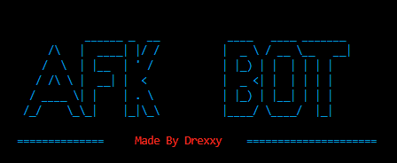

# Minecraft AFK Bot

A lightweight, customizable Minecraft AFK automation tool designed to keep your account active on servers while improving efficiency and reducing the need for supervision.


---

## 📸 Preview

**Console Preview**


---

## 📥 Installation

1. Click **Code** → **Download ZIP**
2. Extract the ZIP anywhere
3. Open the extracted folder
4. Run:

```batch
cd src
start RUNME.bat
````

Or simply double-click **RUNME.bat**

---

## ⭐ Features

* ⏱ Custom jump interval
* 🍗 Auto-eating
* 🛡 Advanced anti-AFK system
* 🪙 Auto-sell (economy servers)
* 🗡 Custom hit delay (works on all versions)
* 🎯 Hold-to-run mode (no toggle)
* 💬 Chat spam mode (custom watermark)
* 🐞 Debug / logging tools

---

## 🔍 Feature Comparison

| Feature                    | Vanilla Minecraft | This AFK Bot |
| -------------------------- | ----------------- | ------------ |
| Auto Jump Interval         | ❌                 | ✅            |
| Auto Eating                | ❌                 | ✅            |
| Anti-AFK                   | ⚠️ Basic / None   | ✅ Advanced   |
| Auto Selling (Eco Servers) | ❌                 | ✅            |
| Custom Hit Delay           | ❌                 | ✅ Universal  |
| Spam Message System        | ❌                 | ✅            |
| Custom Settings            | ⚠️ Limited        | ✅ Full       |
| Debug Options              | ❌                 | ✅            |

---

## 💡 Why This Bot?

Most AFK solutions are either:

* Too simple
* Easily detected
* Too resource-heavy
* Or lack flexibility

This bot focuses on **control, configurability, and consistency**.

**What makes it better?**

* Doesn’t rely on mods
* Runs externally
* Uses human-like timing
* Simple configuration
* Works across multiple server types
* Built specifically for long-term AFK sessions
* Lightweight, minimal resource usage

If you want a bot that just works without bloated features or complex setups, this is it.

---

## ⚙️ Configuration

All settings use basic Python variables.

Example:

```python
jump_delay = 2.5
auto_eat_threshold = 6
spam_message = "AFK Bot Active"
```

**Rules:**

* Numbers → no quotes
* Text → `"quotes only"`

More info:
[https://www.geeksforgeeks.org/python-variables/](https://www.geeksforgeeks.org/python-variables/)

---

## ⚡ Optimization

A slight delay is intentionally included to stabilize timing and avoid repetitive patterns.

Future versions will include:

* Performance presets
* Randomized behavior modes
* Smart server adaptation

---

## 🧩 Troubleshooting

When creating an issue, include:

✅ Error message / screenshot
✅ Server type
✅ Minecraft version
✅ Expected vs actual behavior

This helps solve issues faster.

---

## 🤝 Contributing

Contributions are always welcome:

1. Fork the repo
2. Create a new branch
3. Make your changes
4. Open a Pull Request

---

## 💬 Feedback

📧 **[cheatinginapezx@gmail.com](mailto:cheatinginapezx@gmail.com)**

Suggestions & improvements are welcome.

---

## 🙏 Acknowledgements

* [https://bulldogjob.com/news/449-how-to-write-a-good-readme-for-your-github-project](https://bulldogjob.com/news/449-how-to-write-a-good-readme-for-your-github-project)
* [https://www.youtube.com/shorts/flvX3PDVGbQ](https://www.youtube.com/shorts/flvX3PDVGbQ)

---

## 📜 License

This project is released under the **Unlicense**
You are free to modify, distribute, or use it however you like.

🔗 [https://choosealicense.com/licenses/unlicense/](https://choosealicense.com/licenses/unlicense/)
